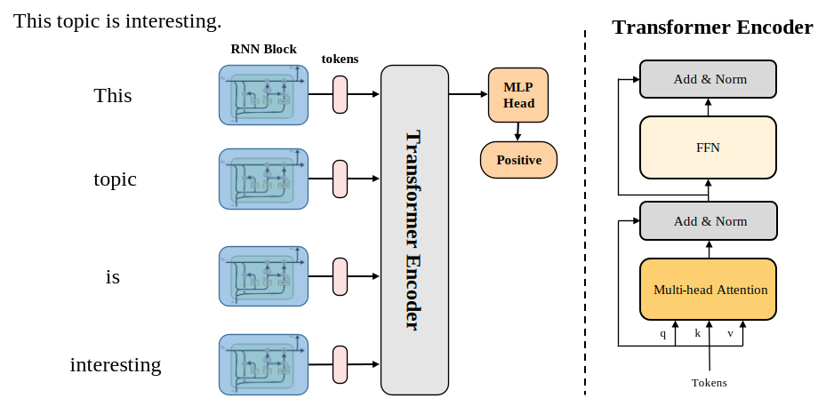
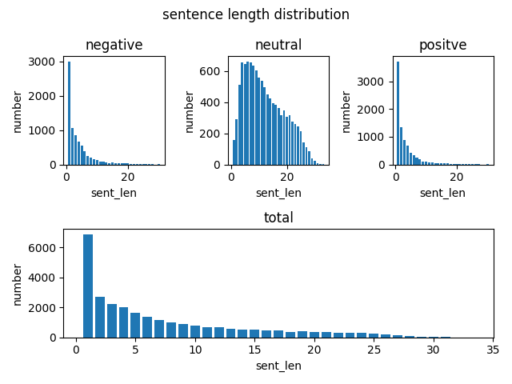
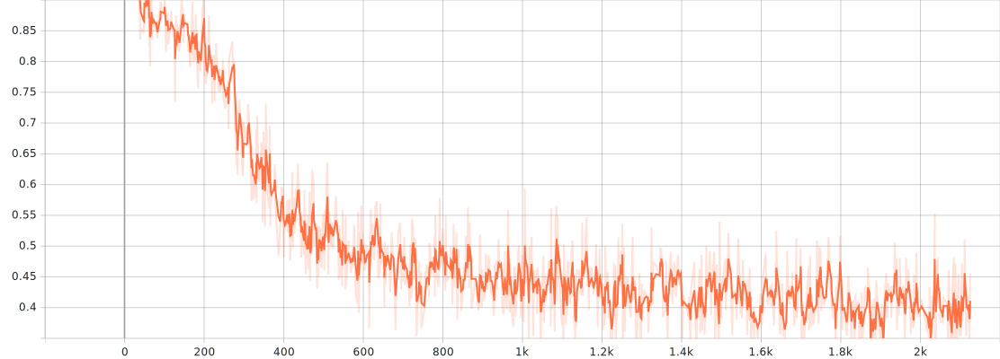

# SentiFormer

Sentiment Analysis by using transformer model.

The model consists of  four components:

1. Glove Word Embedding;
2. Recurrent Neural Network;
3. Transformer Encoder;
4. Classifier;



## Get Started

```bash
python dist_train.py --cfg [config_path]
```

training for tweets dataset:

1. Download dataset from [url](https://www.kaggle.com/datasets/yasserh/twitter-tweets-sentiment-dataset);
2. Put `Tweets.csv` into `data/`;
3. Running `python dist_train.py --cfg configs/tweets/sentiformer_sl15_sgd-lr1e-3_bs256.yaml`;

inference for tweets dataset:

1. Suppose your have already trained a converged model at `work_dirs/tweets/sentiformer_sl15_sgd-lr1e-3_bs256/epoch003_iter0000255_score0.557.pth`;
2. Running `python dist_infer.py --cfg configs/tweets/sentiformer_sl30_sgd-lr1e-4_bs256.yaml --resume work_dirs/tweets/sentiformer_sl15_sgd-lr1e-3_bs256/epoch003_iter0000255_score0.557.pth --input_text "I'm happy."` (--input_text [the text you want to judge sentiment])

## Dataset

[Twitter Tweets Sentiment Dataset](https://www.kaggle.com/datasets/yasserh/twitter-tweets-sentiment-dataset)

This dataset has total three classes:

1. neutral;
2. negative;
3. positive;

Dataset Analysis (The sentence length distribution between different classes):



## Training & Evaluation 

1. Training Curve of SentiFormer on Tweets dataset:



2. Evaluation Results of SentiFormer on Tweets dataset:

| Model       | Sent Len  | Optimizer | Learning Rate | Batch Size | mACC  |
| :--         | :--       | :--       | :--           | :--        | :--   |
| SentiFormer | 15        | SGD       | 1e-3          | 256        | 73.3  |
| SentiFormer | 30        | SGD       | 1e-3          | 256        | 60.8  |
| SentiFormer | 30        | SGD       | 1e-4          | 256        | 53.9  |
